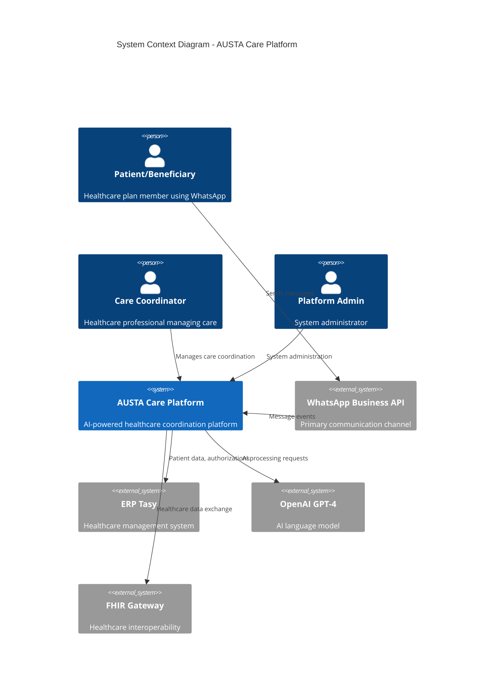
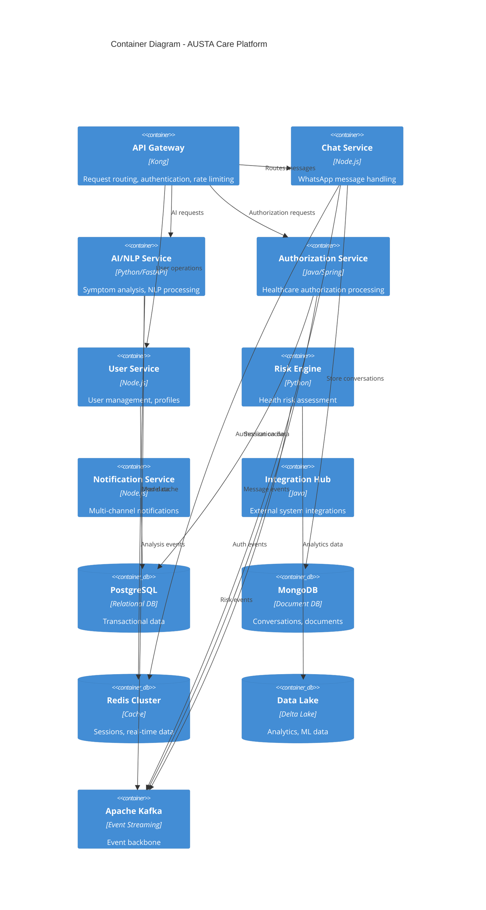
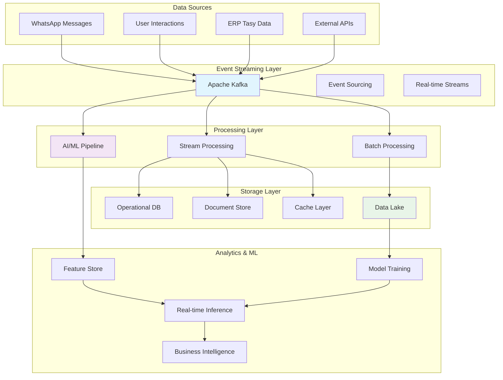
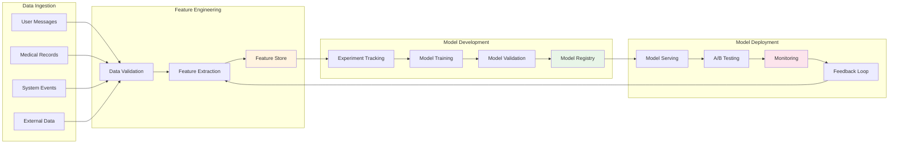
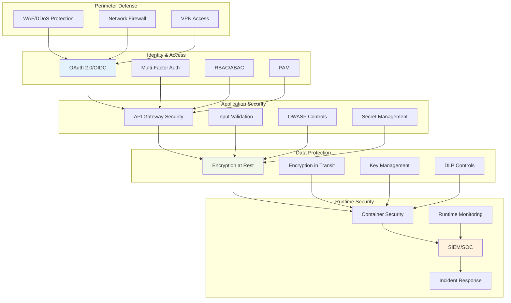
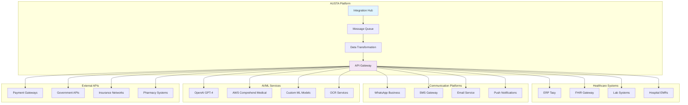
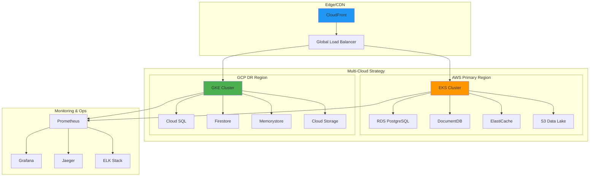
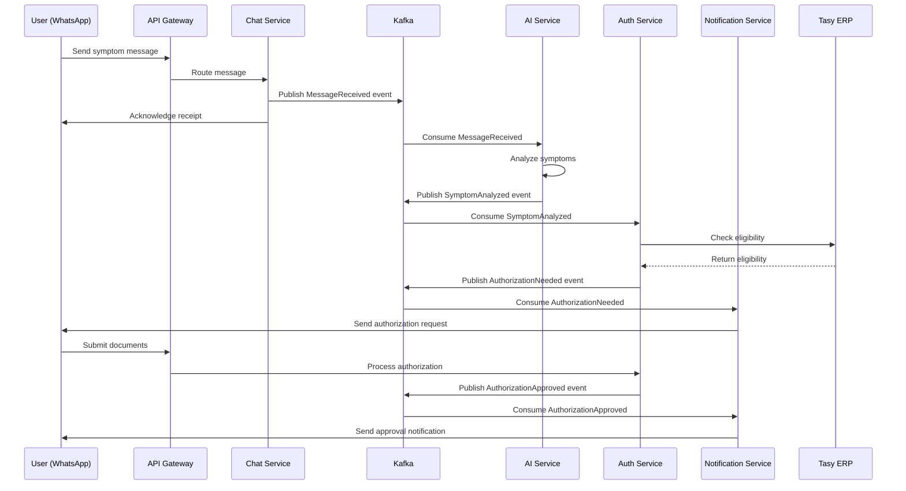
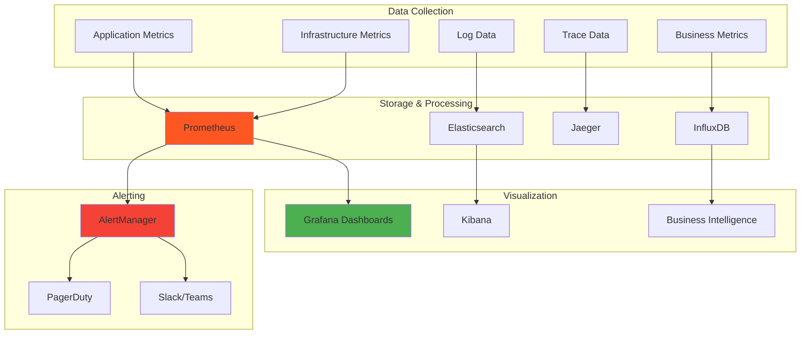

# 🎨 System Architecture Diagrams: AUSTA Care Platform

**Version:** 1.0  
**Date:** July 14, 2025  
**Purpose:** Visual representations of system architecture components

---

## 📊 High-Level System Overview

## 🏗️ Container Architecture

## 🔄 Data Flow Architecture

## 🤖 AI/ML Pipeline Architecture

## 🔐 Security Architecture

## 📡 Integration Architecture

## 🚀 Deployment Architecture

## 🔄 Event-Driven Architecture

## 📊 Monitoring & Observability

---

## 🎯 Diagram Usage Guidelines

### For Development Teams
- Use **Container Diagram** for understanding service boundaries
- Reference **Data Flow** for event handling patterns
- Follow **Security Architecture** for implementation standards

### For Operations Teams
- Monitor using **Monitoring Architecture** components
- Deploy following **Deployment Architecture** patterns
- Integrate systems per **Integration Architecture**

### For Business Stakeholders
- Understand capabilities via **System Overview**
- Track value delivery through **AI/ML Pipeline**
- Assess security posture via **Security Architecture**

### For Compliance Teams
- Validate data flows for LGPD/HIPAA compliance
- Review security controls implementation
- Audit integration patterns for regulatory requirements

---

**Document Maintained By:** System Architecture Agent  
**Last Updated:** July 14, 2025  
**Related Documents:** SYSTEM_ARCHITECTURE_DESIGN.md