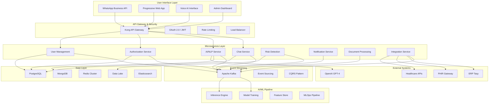
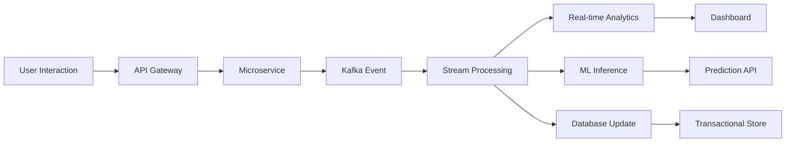
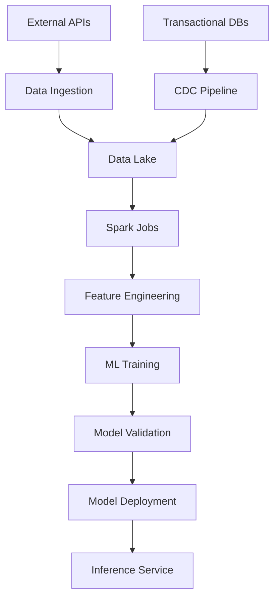
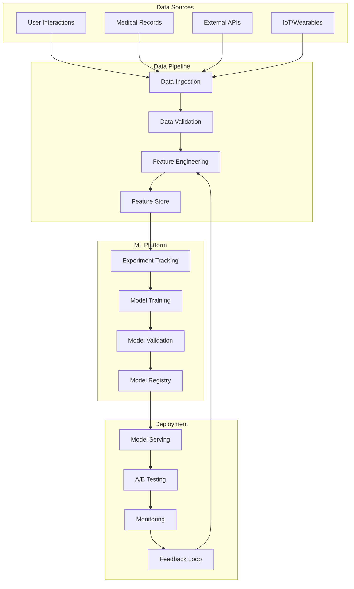
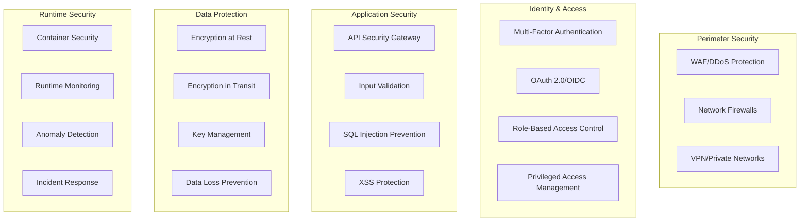
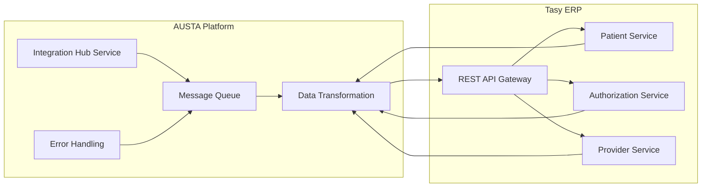
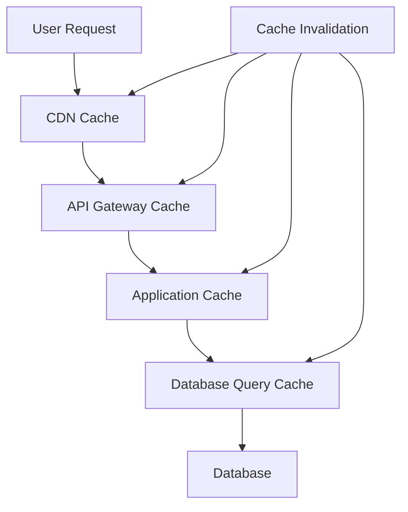

# 🏗️ Comprehensive System Architecture Design: AUSTA Care Platform

**Version:** 1.0  
**Date:** July 14, 2025  
**Architect:** System Architecture Agent  
**Status:** Ready for Implementation

---

## 📋 Table of Contents

1. [Executive Summary](#1-executive-summary)
2. [High-Level System Architecture](#2-high-level-system-architecture)
3. [Microservices Architecture](#3-microservices-architecture)
4. [Data Architecture & Flow](#4-data-architecture--flow)
5. [AI/ML Pipeline Architecture](#5-aiml-pipeline-architecture)
6. [Security & Compliance Architecture](#6-security--compliance-architecture)
7. [Integration Patterns](#7-integration-patterns)
8. [Scalability & Performance Design](#8-scalability--performance-design)
9. [Implementation Roadmap](#9-implementation-roadmap)
10. [Architecture Decision Records](#10-architecture-decision-records)

---

## 1. Executive Summary

### 1.1 Architectural Vision

The AUSTA Care Platform represents a revolutionary healthcare coordination system built on a **cloud-native, event-driven microservices architecture** designed to handle 1000+ messages/second with 99.9% availability. The platform transforms reactive healthcare into a **proactive, AI-powered ecosystem** that predicts and prevents health issues before they become critical.

### 1.2 Key Architectural Principles

- **🎯 Event-Driven First**: Apache Kafka as the central nervous system
- **🔄 Microservices Native**: Independently deployable, scalable services
- **🧠 AI-Powered Core**: Machine Learning embedded throughout the stack
- **🛡️ Security by Design**: Zero-trust architecture with defense in depth
- **☁️ Cloud-Native**: Multi-cloud ready with Kubernetes orchestration
- **📊 Data-Centric**: Real-time analytics and predictive insights

### 1.3 Platform Capabilities Overview

```yaml
Core Features:
  - Conversational AI via WhatsApp (10M+ messages/day)
  - Real-time health risk detection and scoring
  - Automated authorization processing (<30 seconds)
  - Predictive analytics for intervention
  - LGPD/HIPAA compliant data handling
  - Integration with ERP Tasy and healthcare systems

Technical Targets:
  - Latency: <3s WhatsApp response (P95)
  - Throughput: 1000+ messages/second
  - Availability: 99.9% uptime
  - Scalability: 100,000+ concurrent users
  - Security: Zero-tolerance for data breaches
```

---

## 2. High-Level System Architecture

### 2.1 System Overview Diagram



### 2.2 Technology Stack Overview

#### Frontend & User Interface
- **WhatsApp Business API (Meta)**: Primary communication channel
- **React.js + Next.js**: Progressive Web App for admin dashboard
- **AWS Polly + Lex**: Voice AI interface for accessibility
- **Material-UI**: Consistent design system

#### API Gateway & Security
- **Kong Gateway**: API management, rate limiting, authentication
- **OAuth 2.0 + JWT**: Secure authentication and authorization
- **AWS WAF**: Web application firewall
- **Let's Encrypt**: SSL/TLS certificates

#### Microservices Runtime
- **Node.js + Express**: High-performance APIs for real-time services
- **Python + FastAPI**: ML/AI services and data processing
- **Java + Spring Boot**: Enterprise integrations and BPM
- **Golang**: High-performance utility services

#### Event Streaming & Processing
- **Apache Kafka**: Event streaming backbone
- **Apache Kafka Streams**: Real-time stream processing
- **Redis Streams**: Lightweight event handling
- **RabbitMQ**: Message queuing for critical workflows

#### AI/ML Stack
- **OpenAI GPT-4**: Conversational AI and NLP
- **TensorFlow + PyTorch**: Custom ML model development
- **Apache Spark**: Distributed data processing
- **MLflow**: ML lifecycle management
- **Apache Airflow**: ML pipeline orchestration

#### Data Storage
- **PostgreSQL**: Transactional data (users, authorizations)
- **MongoDB**: Document storage (conversations, unstructured data)
- **Redis Cluster**: Distributed caching and session storage
- **Delta Lake**: Data lake for analytics and ML
- **Elasticsearch**: Full-text search and logging

#### Container & Orchestration
- **Docker**: Application containerization
- **Kubernetes**: Container orchestration
- **Istio**: Service mesh for microservices communication
- **ArgoCD**: GitOps continuous deployment

#### Monitoring & Observability
- **Prometheus**: Metrics collection
- **Grafana**: Visualization and dashboards
- **Jaeger**: Distributed tracing
- **ELK Stack**: Centralized logging (Elasticsearch, Logstash, Kibana)
- **New Relic**: Application performance monitoring

---

## 3. Microservices Architecture

### 3.1 Service Decomposition Strategy

#### Core Business Services

**1. Chat Orchestration Service**
```yaml
Responsibility: Manage WhatsApp conversations and routing
Tech Stack: Node.js + Express + Socket.io
Database: MongoDB (conversation history) + Redis (session state)
Key Features:
  - Real-time message processing
  - Conversation state management
  - Multi-session handling
  - Message routing and queuing
API Endpoints:
  - POST /api/v1/messages/send
  - GET /api/v1/conversations/{userId}
  - WebSocket /ws/conversations
```

**2. AI/NLP Service**
```yaml
Responsibility: Natural language processing and AI inference
Tech Stack: Python + FastAPI + TensorFlow
Database: MongoDB (training data) + Redis (model cache)
Key Features:
  - Symptom analysis and extraction
  - Intent recognition and classification
  - Sentiment analysis
  - Medical entity recognition (NER)
  - Risk scoring algorithms
API Endpoints:
  - POST /api/v1/ai/analyze-symptom
  - POST /api/v1/ai/extract-entities
  - POST /api/v1/ai/risk-score
```

**3. Authorization Engine Service**
```yaml
Responsibility: Automated authorization processing
Tech Stack: Java + Spring Boot + Camunda BPM
Database: PostgreSQL (authorizations) + MongoDB (documents)
Key Features:
  - Real-time eligibility checking
  - Document OCR and validation
  - BPM workflow orchestration
  - Integration with ERP Tasy
  - Fraud detection algorithms
API Endpoints:
  - POST /api/v1/auth/request
  - GET /api/v1/auth/status/{authId}
  - POST /api/v1/auth/approve
```

**4. User Management Service**
```yaml
Responsibility: User lifecycle and profile management
Tech Stack: Node.js + Express + Passport.js
Database: PostgreSQL (user data) + Redis (sessions)
Key Features:
  - User registration and onboarding
  - Profile management and updates
  - Gamification (HealthPoints) system
  - Consent management (LGPD)
  - Multi-factor authentication
API Endpoints:
  - POST /api/v1/users/register
  - GET /api/v1/users/profile/{userId}
  - PUT /api/v1/users/preferences
```

**5. Risk Detection Service**
```yaml
Responsibility: Health risk assessment and prediction
Tech Stack: Python + FastAPI + XGBoost + scikit-learn
Database: PostgreSQL (risk scores) + Data Lake (historical data)
Key Features:
  - Pre-existing condition detection
  - Population risk stratification
  - Predictive modeling (30-day risk)
  - Anomaly detection
  - Clinical decision support
API Endpoints:
  - POST /api/v1/risk/assess
  - GET /api/v1/risk/population-score
  - POST /api/v1/risk/predict
```

#### Supporting Services

**6. Notification Service**
```yaml
Responsibility: Multi-channel notification delivery
Tech Stack: Node.js + Express + Bull Queue
Database: Redis (queue) + MongoDB (templates)
Channels: WhatsApp, SMS, Email, Push notifications
Features:
  - Template management
  - Delivery optimization
  - Retry mechanisms
  - Analytics and tracking
```

**7. Document Processing Service**
```yaml
Responsibility: OCR and document analysis
Tech Stack: Python + FastAPI + Tesseract + AWS Textract
Database: MongoDB (documents) + S3 (file storage)
Features:
  - Multi-format OCR (PDF, images)
  - Medical document recognition
  - Data extraction and validation
  - Fraud detection algorithms
```

**8. Integration Hub Service**
```yaml
Responsibility: External system integrations
Tech Stack: Java + Spring Boot + Apache Camel
Database: PostgreSQL (integration logs)
Integrations: ERP Tasy, FHIR systems, healthcare APIs
Features:
  - API orchestration
  - Data transformation
  - Error handling and retry
  - Monitoring and logging
```

### 3.2 Service Communication Patterns

#### Synchronous Communication
- **REST APIs**: For request-response patterns
- **GraphQL**: For complex data fetching (mobile/web clients)
- **gRPC**: For high-performance service-to-service communication

#### Asynchronous Communication
- **Event-Driven**: Apache Kafka for domain events
- **Message Queues**: RabbitMQ for reliable messaging
- **Pub/Sub**: Redis Pub/Sub for real-time notifications

#### Service Discovery & Load Balancing
- **Kubernetes DNS**: Service discovery within cluster
- **Istio Service Mesh**: Traffic management and load balancing
- **Circuit Breakers**: Resilience patterns (Hystrix/Resilience4j)

---

## 4. Data Architecture & Flow

### 4.1 Data Storage Strategy

#### Polyglot Persistence Approach

**PostgreSQL - Transactional Data**
```yaml
Purpose: ACID-compliant transactional data
Tables:
  - users (profile, demographics, preferences)
  - authorizations (requests, approvals, status)
  - providers (healthcare network directory)
  - audit_logs (compliance and security)
  - risk_scores (calculated risk assessments)
Configuration:
  - Master-slave replication
  - Read replicas for analytics
  - Automated backups (point-in-time recovery)
  - Connection pooling (PgBouncer)
```

**MongoDB - Document Store**
```yaml
Purpose: Flexible document storage
Collections:
  - conversations (WhatsApp message history)
  - documents (OCR results, medical records)
  - ai_training_data (ML model training sets)
  - knowledge_base (medical knowledge graph)
  - templates (message and notification templates)
Configuration:
  - Replica set with 3 nodes
  - Sharding for horizontal scaling
  - GridFS for large file storage
  - Change streams for real-time sync
```

**Redis Cluster - Caching & Sessions**
```yaml
Purpose: High-performance caching and session management
Data Types:
  - session_store (user sessions and state)
  - conversation_cache (active conversation contexts)
  - model_cache (ML model predictions)
  - rate_limiting (API rate limit counters)
  - real_time_metrics (dashboard data)
Configuration:
  - 6-node cluster (3 master, 3 replica)
  - Automatic failover
  - Memory optimization
  - TTL-based expiration
```

**Data Lake - Analytics & ML**
```yaml
Purpose: Big data analytics and machine learning
Format: Delta Lake (Parquet + transaction log)
Partitioning: By date, user_segment, event_type
Data Types:
  - Raw events (user interactions, system events)
  - Processed features (ML feature engineering)
  - Model artifacts (trained models, metrics)
  - Business intelligence (aggregated metrics)
Storage: AWS S3 / Google Cloud Storage
Processing: Apache Spark + Databricks
```

### 4.2 Data Flow Architecture

#### Real-Time Data Processing Pipeline



#### Batch Data Processing Pipeline



#### Event-Driven Data Architecture

**Event Types & Schema:**

```yaml
UserRegistered:
  schema:
    user_id: string
    timestamp: datetime
    profile_data: object
    consent_status: object
  routing_key: "user.registered"

ConversationStarted:
  schema:
    conversation_id: string
    user_id: string
    channel: string (whatsapp/web/voice)
    context: object
  routing_key: "conversation.started"

SymptomAnalyzed:
  schema:
    analysis_id: string
    user_id: string
    symptoms: array
    risk_score: number
    recommendations: array
  routing_key: "ai.symptom.analyzed"

AuthorizationRequested:
  schema:
    auth_id: string
    user_id: string
    procedure_code: string
    provider_id: string
    urgency_level: string
  routing_key: "auth.requested"

RiskScoreCalculated:
  schema:
    user_id: string
    risk_score: number
    risk_factors: array
    recommendations: array
    expires_at: datetime
  routing_key: "risk.calculated"
```

### 4.3 Data Governance & Quality

#### Data Quality Framework
- **Validation Rules**: Schema validation at ingestion
- **Data Lineage**: Track data from source to consumption
- **Quality Metrics**: Completeness, accuracy, timeliness
- **Automated Testing**: Data quality tests in CI/CD pipeline

#### LGPD/HIPAA Compliance
- **Data Classification**: PII, PHI, public data tagging
- **Encryption**: AES-256 at rest, TLS 1.3 in transit
- **Access Controls**: Role-based access control (RBAC)
- **Audit Logging**: Complete audit trail for data access
- **Data Retention**: Automated retention policy enforcement
- **Right to Erasure**: Automated data deletion workflows

---

## 5. AI/ML Pipeline Architecture

### 5.1 Machine Learning Platform Overview

#### MLOps Architecture



### 5.2 AI/ML Models & Use Cases

#### 1. Conversational AI Models

**Symptom Analysis Model**
```yaml
Purpose: Analyze user-reported symptoms and determine urgency
Architecture: Fine-tuned GPT-4 + Custom Classification Layer
Training Data:
  - Medical symptom datasets
  - AUSTA historical conversations
  - Medical literature (PubMed)
Features:
  - Multi-language support (Portuguese variants)
  - Context-aware responses
  - Uncertainty quantification
Performance Metrics:
  - Accuracy: >95% for symptom classification
  - Sensitivity: >98% for high-risk symptoms
  - Specificity: >90% to avoid false alarms
```

**Intent Recognition Model**
```yaml
Purpose: Understand user intent in conversations
Architecture: BERT-based transformer + Intent classification
Training Data:
  - Conversational datasets
  - Domain-specific intents (healthcare)
Classes:
  - symptom_report, authorization_request, 
  - appointment_booking, general_inquiry,
  - emergency_situation, medication_question
Performance: >92% F1-score on test set
```

#### 2. Risk Prediction Models

**30-Day Hospitalization Risk Model**
```yaml
Purpose: Predict probability of hospitalization in next 30 days
Architecture: Gradient Boosting (XGBoost) + Feature engineering
Features:
  - Demographics (age, gender, location)
  - Medical history (conditions, medications)
  - Utilization patterns (claims, visits)
  - Social determinants (income, education)
  - Behavioral signals (app usage, compliance)
Model Performance:
  - AUC-ROC: 0.87
  - Precision: 0.82 (top 10% risk scores)
  - Recall: 0.76 (actual hospitalizations)
Retraining: Weekly on new data
```

**Chronic Disease Progression Model**
```yaml
Purpose: Predict progression of chronic conditions
Architecture: LSTM Neural Network + Time series analysis
Conditions: Diabetes, Hypertension, Heart Disease, COPD
Features:
  - Lab values over time
  - Medication adherence
  - Lifestyle factors
  - Symptom reports
Model Performance:
  - Diabetes: 0.84 AUC for A1C >8%
  - Hypertension: 0.79 AUC for uncontrolled BP
Update Frequency: Monthly
```

#### 3. Document Processing Models

**Medical OCR Model**
```yaml
Purpose: Extract structured data from medical documents
Architecture: Transformer + CNN for document understanding
Documents Supported:
  - Prescriptions, Lab reports, Insurance cards
  - Medical certificates, Discharge summaries
Accuracy:
  - Text extraction: >98%
  - Structured data: >95%
  - Field classification: >97%
```

**Fraud Detection Model**
```yaml
Purpose: Detect fraudulent authorization requests
Architecture: Ensemble (Random Forest + Anomaly Detection)
Features:
  - Provider patterns
  - Patient behavior
  - Document authenticity scores
  - Network analysis features
Performance:
  - True Positive Rate: 0.89
  - False Positive Rate: <0.02
  - Cost Savings: $2M+ annually
```

### 5.3 Model Deployment & Serving

#### Model Serving Infrastructure

**Real-Time Inference**
```yaml
Platform: TensorFlow Serving + NVIDIA Triton
Deployment: Kubernetes + GPU nodes
Scaling: Horizontal pod autoscaling
Latency: <100ms P99 for model inference
Throughput: 1000+ predictions/second
Load Balancing: Round-robin with health checks
```

**Batch Inference**
```yaml
Platform: Apache Spark + MLflow
Schedule: Daily for risk scoring, Weekly for population analysis
Data Source: Data Lake (Delta format)
Processing: Distributed computation across cluster
Output: Updated risk scores in PostgreSQL
Monitoring: Airflow for pipeline orchestration
```

#### A/B Testing Framework

```yaml
Experimentation Platform: Custom-built on Apache Kafka
Traffic Splitting: 
  - Control: 80% (current model)
  - Treatment: 20% (new model)
Metrics Tracked:
  - Model accuracy and latency
  - Business metrics (conversion, satisfaction)
  - User experience metrics
Statistical Testing: Sequential probability ratio tests
Rollback: Automated based on performance degradation
```

---

## 6. Security & Compliance Architecture

### 6.1 Zero-Trust Security Model

#### Defense in Depth Strategy



### 6.2 Compliance Framework

#### LGPD (Lei Geral de Proteção de Dados) Compliance

**Data Processing Legal Bases**
```yaml
Consent Management:
  - Granular consent for different data processing purposes
  - Consent withdrawal mechanisms
  - Audit trail for all consent changes
  - Regular consent renewal workflows

Data Subject Rights:
  - Right of access (data portability API)
  - Right to rectification (self-service profile updates)
  - Right to erasure (automated deletion workflows)
  - Right to data portability (standardized export formats)

Privacy by Design:
  - Data minimization in collection
  - Purpose limitation enforcement
  - Storage limitation with automated retention
  - Transparency through privacy dashboard
```

**Technical Implementation**
```yaml
Data Classification:
  - Personal Data: Encrypted with customer-managed keys
  - Sensitive Personal Data: Additional access controls
  - Public Data: Standard encryption

Encryption Standards:
  - At Rest: AES-256 with key rotation
  - In Transit: TLS 1.3 with certificate pinning
  - Application Level: Field-level encryption for PHI

Access Controls:
  - Attribute-based access control (ABAC)
  - Just-in-time access for privileged operations
  - Zero-standing privileges
  - Continuous access monitoring
```

#### HIPAA Compliance (US Healthcare Data)

**Business Associate Agreement (BAA)**
```yaml
Meta WhatsApp BAA:
  - Signed agreement for PHI transmission
  - End-to-end encryption requirement
  - Audit logging for all PHI access
  - Incident notification procedures

Technical Safeguards:
  - Unique user identification
  - Emergency access procedures
  - Automatic logoff
  - Encryption and decryption controls

Administrative Safeguards:
  - Security officer designation
  - Workforce training programs
  - Information access management
  - Security incident procedures

Physical Safeguards:
  - Facility access controls
  - Workstation use restrictions
  - Device and media controls
```

### 6.3 Security Monitoring & Incident Response

#### Security Operations Center (SOC)

**Threat Detection Stack**
```yaml
SIEM Platform: Splunk/Elastic Security
Log Sources:
  - Application logs (structured JSON)
  - Infrastructure logs (Kubernetes, cloud services)
  - Network logs (firewall, proxy, DNS)
  - Security tool logs (vulnerability scanners, WAF)

Threat Intelligence:
  - MITRE ATT&CK framework mapping
  - IoC feeds integration
  - Custom threat intelligence
  - Automated threat hunting

Alert Correlation:
  - Machine learning-based anomaly detection
  - Rule-based correlation engines
  - Behavioral analysis baselines
  - False positive reduction algorithms
```

**Incident Response Playbooks**
```yaml
P1 - Critical Security Incident:
  - Data breach or unauthorized PHI access
  - Response Time: <15 minutes
  - Escalation: CISO, Legal, Executive team
  - Actions: Isolate, preserve evidence, notify authorities

P2 - High Security Event:
  - Failed authentication anomalies
  - Suspicious file access patterns
  - Response Time: <1 hour
  - Actions: Investigate, temporary blocks, monitoring

P3 - Medium Security Alert:
  - Policy violations
  - Unusual network traffic
  - Response Time: <4 hours
  - Actions: Log analysis, user verification

Automated Response:
  - IP blocking for malicious sources
  - Account lockout for brute force attempts
  - Rate limiting for suspicious API usage
  - Container quarantine for malware detection
```

---

## 7. Integration Patterns

### 7.1 External System Integration Architecture

#### ERP Tasy Integration

**Integration Strategy: Real-time + Batch Hybrid**

```yaml
Real-time Integrations (REST APIs):
  Endpoints:
    - Patient eligibility checking
    - Authorization request submission
    - Provider directory queries
    - Real-time claim status
  
  Authentication: OAuth 2.0 + Client certificates
  Rate Limiting: 1000 requests/minute
  Failover: Circuit breaker + message queue fallback
  SLA: 99.9% availability, <500ms response time

Batch Integrations (Scheduled):
  Data Synchronization:
    - Daily: Member roster updates
    - Weekly: Provider network changes
    - Monthly: Benefit plan updates
    - Quarterly: Full reconciliation
  
  Format: HL7 FHIR R4 + Custom extensions
  Transport: SFTP + PGP encryption
  Monitoring: Automated validation + alerting
```

**Integration Architecture Diagram**



#### WhatsApp Business API Integration

**Multi-Number Strategy for Scale**
```yaml
Number Configuration:
  Primary Numbers: 5 (for production traffic)
  Backup Numbers: 2 (for failover)
  Testing Numbers: 2 (for development/staging)

Load Distribution:
  Strategy: User hash-based routing
  Failover: Automatic failover to backup numbers
  Rate Limiting: Per-number limits monitoring
  Health Checks: Continuous webhook monitoring

Message Types:
  - Text messages (primary communication)
  - Rich media (images, documents, audio)
  - Interactive messages (buttons, lists)
  - Template messages (notifications)

Webhook Architecture:
  - Dedicated webhook endpoints per number
  - Kubernetes ingress for load balancing
  - Message deduplication logic
  - Retry mechanism for failed deliveries
```

#### FHIR Gateway Integration

**Healthcare Interoperability Layer**
```yaml
FHIR R4 Compliance:
  Resources Supported:
    - Patient (demographic information)
    - Observation (vital signs, lab results)
    - DiagnosticReport (medical reports)
    - MedicationRequest (prescriptions)
    - Encounter (healthcare visits)
    - Organization (healthcare providers)

Data Mapping:
  Source: AUSTA internal data model
  Target: FHIR R4 standard format
  Transformation: Apache Camel + FHIR libraries
  Validation: Schema validation + business rules

Security:
  - OAuth 2.0 SMART on FHIR
  - Patient consent verification
  - Audit logging for all access
  - Rate limiting per client
```

### 7.2 API Design & Standards

#### REST API Design Principles

**Richardson Maturity Model Level 3 (HATEOAS)**
```yaml
Resource Naming:
  - Nouns (not verbs): /users, /conversations, /authorizations
  - Hierarchical: /users/{id}/conversations/{conversationId}
  - Consistent pluralization
  - Lowercase with hyphens: /health-records

HTTP Methods:
  - GET: Retrieve resources (idempotent)
  - POST: Create new resources
  - PUT: Full resource update (idempotent)
  - PATCH: Partial resource update
  - DELETE: Remove resources (idempotent)

Status Codes:
  - 200 OK: Successful retrieval
  - 201 Created: Successful creation
  - 204 No Content: Successful deletion
  - 400 Bad Request: Client error
  - 401 Unauthorized: Authentication required
  - 403 Forbidden: Access denied
  - 404 Not Found: Resource not found
  - 429 Too Many Requests: Rate limit exceeded
  - 500 Internal Server Error: Server error
```

**API Versioning Strategy**
```yaml
Versioning Approach: Header-based versioning
Header: Accept: application/vnd.austa.v1+json

Version Support:
  - Current version: Full support + new features
  - Previous version: Security patches only
  - End-of-life: 12 months deprecation notice

Breaking Changes:
  - New major version for breaking changes
  - Backward compatibility within major version
  - Migration guides for version upgrades
  - Automated testing for version compatibility
```

#### GraphQL Gateway

**Unified Data Layer**
```yaml
Schema Design:
  - Type-first approach with schema federation
  - Consistent naming conventions
  - Rich type system with custom scalars
  - Input validation with custom directives

Performance Optimization:
  - Query complexity analysis
  - Query depth limiting
  - Automatic persisted queries
  - DataLoader for N+1 query prevention

Security:
  - Query authorization at field level
  - Rate limiting per query complexity
  - Query whitelisting for production
  - Introspection disabled in production

Real-time Features:
  - GraphQL subscriptions over WebSocket
  - Live query updates for dashboards
  - Real-time notification delivery
```

---

## 8. Scalability & Performance Design

### 8.1 Horizontal Scaling Architecture

#### Auto-Scaling Strategy

**Application Layer Scaling**
```yaml
Kubernetes HPA (Horizontal Pod Autoscaler):
  Metrics:
    - CPU utilization: Target 70%
    - Memory utilization: Target 80%
    - Custom metrics: Queue depth, response time
  
  Scaling Behavior:
    - Scale up: Aggressive (double pods in 30 seconds)
    - Scale down: Conservative (reduce by 10% every 5 minutes)
  
  Resource Limits:
    - Min replicas: 3 per service
    - Max replicas: 50 per service
    - Resource quotas per namespace

Service-Specific Scaling:
  Chat Service:
    - Scale on active connections
    - WebSocket connection pooling
    - Session affinity for stateful connections
  
  AI/NLP Service:
    - Scale on GPU utilization
    - Model loading optimization
    - Inference batching for efficiency
  
  Authorization Service:
    - Scale on queue depth
    - Circuit breaker patterns
    - Async processing with callbacks
```

**Database Scaling Strategy**
```yaml
PostgreSQL:
  Read Scaling:
    - Read replicas (3 replicas minimum)
    - Connection pooling (PgBouncer)
    - Query optimization and indexing
    - Materialized views for complex queries
  
  Write Scaling:
    - Connection pooling
    - Batch operations where possible
    - Async replication to read replicas
    - Partitioning for large tables

MongoDB:
  Horizontal Scaling:
    - Sharding across multiple nodes
    - Shard key optimization
    - Balanced data distribution
    - Index optimization per shard
  
  Read Scaling:
    - Read preference to secondary nodes
    - Read concern optimization
    - Connection pooling
    - Aggregation pipeline optimization

Redis Cluster:
  Horizontal Scaling:
    - Hash slot redistribution
    - Automatic failover
    - Memory optimization
    - Pipeline operations for bulk operations
```

### 8.2 Performance Optimization

#### Caching Strategy

**Multi-Layer Caching Architecture**



**Cache Implementation Details**
```yaml
CDN Layer (CloudFront/CloudFlare):
  - Static assets (images, CSS, JS)
  - API responses with long TTL
  - Geographic distribution
  - Cache invalidation via API

API Gateway Cache (Kong):
  - Response caching (5-60 minutes TTL)
  - Rate limiting counters
  - Authentication tokens
  - Route-specific cache policies

Application Cache (Redis):
  - Session data (30 minutes TTL)
  - Frequently accessed data (varies by use case)
  - ML model predictions (24 hours TTL)
  - User preferences (1 hour TTL)

Database Query Cache:
  - PostgreSQL: Query result caching
  - MongoDB: Aggregation pipeline caching
  - Cache warming strategies
  - Intelligent cache prefetching
```

#### Performance Monitoring & Optimization

**Real-Time Performance Metrics**
```yaml
Application Metrics:
  - Request rate (requests per second)
  - Response time (P50, P95, P99)
  - Error rate (percentage of failed requests)
  - Throughput (data processed per second)

Infrastructure Metrics:
  - CPU utilization per service
  - Memory usage and garbage collection
  - Network I/O and bandwidth
  - Disk I/O and storage usage

Business Metrics:
  - WhatsApp message delivery rate
  - Authorization processing time
  - User satisfaction scores
  - System availability percentage

Alerting Thresholds:
  - Response time P95 > 3 seconds
  - Error rate > 1%
  - CPU utilization > 80%
  - Memory usage > 85%
  - Queue depth > 1000 messages
```

**Performance Testing Strategy**
```yaml
Load Testing:
  - Tool: Apache JMeter + custom scripts
  - Scenarios: Normal load, peak load, stress test
  - Targets: 1000 concurrent users, 10k messages/minute
  - Duration: 1-4 hours sustained load

Chaos Engineering:
  - Tool: Chaos Monkey + Litmus
  - Scenarios: Pod failures, network issues, database failures
  - Frequency: Weekly automated tests
  - Recovery time: <5 minutes for critical services

Performance Baseline:
  - Regular performance benchmarking
  - Performance regression testing
  - Automated performance CI/CD gates
  - Performance budgets for new features
```

---

## 9. Implementation Roadmap

### 9.1 Phased Implementation Strategy

#### Phase 1: Foundation & MVP (Months 1-3)

**Sprint 1-2: Infrastructure Foundation**
```yaml
Week 1-2: Cloud Infrastructure Setup
  - AWS/GCP multi-cloud setup
  - Kubernetes cluster deployment
  - Basic monitoring stack (Prometheus/Grafana)
  - CI/CD pipeline setup (GitHub Actions + ArgoCD)

Week 3-4: Core Services Development
  - API Gateway setup (Kong)
  - User Management Service (basic CRUD)
  - Database setup (PostgreSQL + MongoDB)
  - WhatsApp Business API integration
```

**Sprint 3-4: Core Business Logic**
```yaml
Week 5-6: Conversation Management
  - Chat Orchestration Service
  - Basic chatbot functionality
  - Message routing and queuing
  - Session management

Week 7-8: Authorization Engine
  - Basic authorization workflow
  - Tasy ERP integration
  - Document upload and storage
  - Simple approval process
```

**Sprint 5-6: AI Integration & Testing**
```yaml
Week 9-10: AI/NLP Service
  - OpenAI GPT-4 integration
  - Basic symptom analysis
  - Intent recognition
  - Risk scoring (rule-based)

Week 11-12: Testing & Launch Preparation
  - End-to-end testing
  - Performance testing
  - Security testing
  - Beta user testing
```

#### Phase 2: Intelligence & Automation (Months 4-6)

**Advanced AI Features**
```yaml
Month 4: Machine Learning Pipeline
  - MLOps infrastructure setup
  - Custom ML model development
  - Automated model training pipeline
  - A/B testing framework

Month 5: Advanced Automation
  - BPM workflow engine (Camunda)
  - Advanced authorization logic
  - Predictive risk modeling
  - Proactive intervention triggers

Month 6: Analytics & Optimization
  - Advanced analytics dashboard
  - Business intelligence reporting
  - Performance optimization
  - User experience improvements
```

#### Phase 3: Scale & Advanced Features (Months 7-9)

**Enterprise Features**
```yaml
Month 7: Enterprise Integration
  - FHIR gateway implementation
  - Advanced security features
  - Compliance automation
  - Multi-tenant architecture

Month 8: Advanced AI Capabilities
  - Custom NLP models
  - Computer vision for documents
  - Predictive analytics
  - Personalization engine

Month 9: Optimization & Scale
  - Performance optimization
  - Advanced caching strategies
  - Multi-region deployment
  - Disaster recovery testing
```

### 9.2 Success Metrics & KPIs

#### Technical KPIs
```yaml
Performance Metrics:
  - API Response Time P95: <200ms (Target: <100ms)
  - WhatsApp Message Latency: <3s (Target: <1s)
  - System Availability: 99.9% (Target: 99.95%)
  - Error Rate: <0.1% (Target: <0.05%)

Scalability Metrics:
  - Concurrent Users: 10,000+ (Target: 100,000+)
  - Messages per Second: 1,000+ (Target: 10,000+)
  - Auto-scaling Response Time: <30s (Target: <10s)
  - Database Query Time P95: <100ms (Target: <50ms)
```

#### Business KPIs
```yaml
User Experience:
  - Onboarding Completion Rate: >80%
  - User Satisfaction (NPS): >70
  - First Call Resolution: >75%
  - Message Success Rate: >99%

Operational Efficiency:
  - Authorization Processing Time: <30s (Target: <10s)
  - Automation Rate: >85%
  - Cost per User per Month: <$0.50
  - Manual Intervention Rate: <10%

Health Outcomes:
  - Risk Detection Accuracy: >95%
  - Preventive Care Uptake: +25%
  - Sinistralidade Reduction: -15%
  - Clinical Guideline Adherence: >90%
```

---

## 10. Architecture Decision Records (ADRs)

### ADR-001: Event-Driven Architecture with Apache Kafka

**Status:** Accepted  
**Date:** 2025-07-14

**Context:**
The AUSTA Care Platform requires real-time processing of health events, user interactions, and system notifications. Traditional request-response patterns would create tight coupling between services and limit scalability.

**Decision:**
Implement event-driven architecture using Apache Kafka as the primary event streaming platform.

**Consequences:**
- ✅ Loose coupling between microservices
- ✅ Better scalability and fault tolerance
- ✅ Real-time analytics and monitoring
- ❌ Increased complexity in debugging
- ❌ Additional infrastructure overhead

### ADR-002: Multi-Cloud Strategy (AWS Primary, GCP Disaster Recovery)

**Status:** Accepted  
**Date:** 2025-07-14

**Context:**
Healthcare applications require maximum availability and disaster recovery capabilities. Single cloud dependency creates risk of vendor lock-in and catastrophic failure.

**Decision:**
Deploy primary workloads on AWS with disaster recovery on Google Cloud Platform.

**Consequences:**
- ✅ Reduced vendor lock-in risk
- ✅ Better disaster recovery capabilities
- ✅ Negotiation leverage with cloud providers
- ❌ Increased complexity in management
- ❌ Higher operational costs

### ADR-003: Polyglot Persistence Strategy

**Status:** Accepted  
**Date:** 2025-07-14

**Context:**
Different data patterns require different storage solutions. Healthcare data includes structured transactional data, unstructured documents, time-series data, and graph relationships.

**Decision:**
Use multiple database technologies optimized for specific use cases:
- PostgreSQL for transactional data
- MongoDB for document storage
- Redis for caching and sessions
- Data Lake for analytics

**Consequences:**
- ✅ Optimal performance for each data type
- ✅ Flexibility in data modeling
- ✅ Scalability for different workloads
- ❌ Increased operational complexity
- ❌ Need for specialized expertise

### ADR-004: Kubernetes-Native Deployment

**Status:** Accepted  
**Date:** 2025-07-14

**Context:**
The platform needs to scale rapidly, deploy frequently, and maintain high availability across multiple environments.

**Decision:**
Deploy all services on Kubernetes with GitOps deployment using ArgoCD.

**Consequences:**
- ✅ Container orchestration and auto-scaling
- ✅ Declarative infrastructure management
- ✅ Rolling deployments with zero downtime
- ❌ Learning curve for development teams
- ❌ Additional infrastructure complexity

### ADR-005: Fine-Tuned GPT-4 for Medical Conversations

**Status:** Accepted  
**Date:** 2025-07-14

**Context:**
General-purpose language models may not have sufficient accuracy for medical symptom analysis and healthcare conversations.

**Decision:**
Use OpenAI GPT-4 as the base model with healthcare-specific fine-tuning for Portuguese medical conversations.

**Consequences:**
- ✅ High accuracy for medical conversations
- ✅ Faster implementation vs building from scratch
- ✅ Regular model updates from OpenAI
- ❌ Dependency on external API
- ❌ Costs scale with usage

---

## 🎯 Conclusion

This comprehensive system architecture design provides a robust foundation for the AUSTA Care Platform that will:

1. **Scale to millions of users** through cloud-native microservices architecture
2. **Deliver sub-3-second response times** through intelligent caching and optimization
3. **Maintain 99.9% availability** through multi-cloud deployment and failover mechanisms
4. **Ensure data security and compliance** through zero-trust architecture and comprehensive audit trails
5. **Enable predictive healthcare** through advanced AI/ML pipeline and real-time analytics
6. **Reduce operational costs** through automation and intelligent resource management

### Key Architectural Strengths

- **Event-Driven Foundation**: Enables real-time processing and loose coupling
- **AI-First Design**: Machine learning embedded throughout the platform
- **Security by Design**: Comprehensive security controls at every layer
- **Observability Native**: Built-in monitoring, logging, and alerting
- **Multi-Cloud Ready**: Vendor-agnostic deployment strategy
- **Compliance Built-In**: LGPD/HIPAA compliance as architectural requirement

### Next Steps

1. **Infrastructure Setup**: Begin with Phase 1 implementation
2. **Team Formation**: Assemble specialized teams for each domain
3. **Pilot Implementation**: Start with limited user base for validation
4. **Iterative Development**: Follow agile development with continuous feedback
5. **Scale Gradually**: Expand capabilities and user base incrementally

This architecture positions AUSTA as a leader in healthcare technology, enabling the transformation from reactive to predictive healthcare delivery while maintaining the highest standards of security, compliance, and user experience.

---

**Document Maintained By:** System Architecture Agent  
**Last Updated:** July 14, 2025  
**Next Review:** August 14, 2025